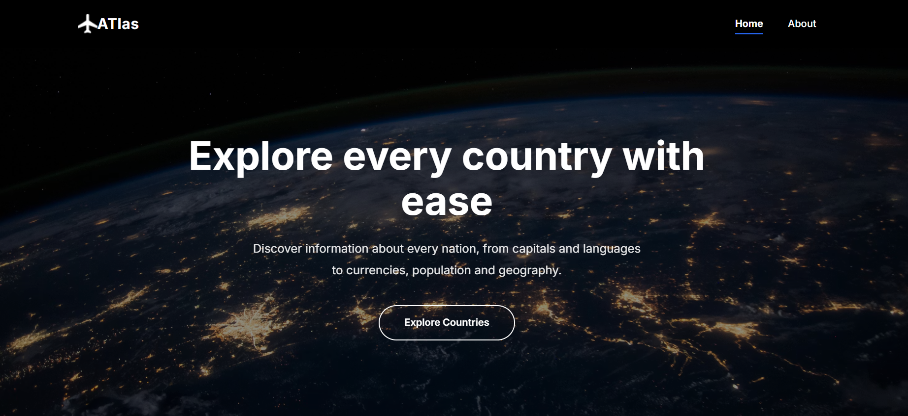
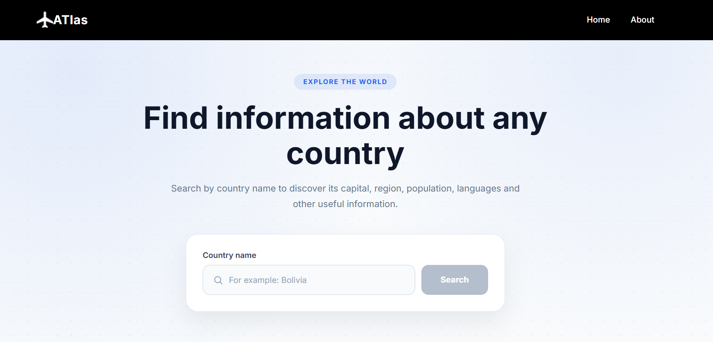
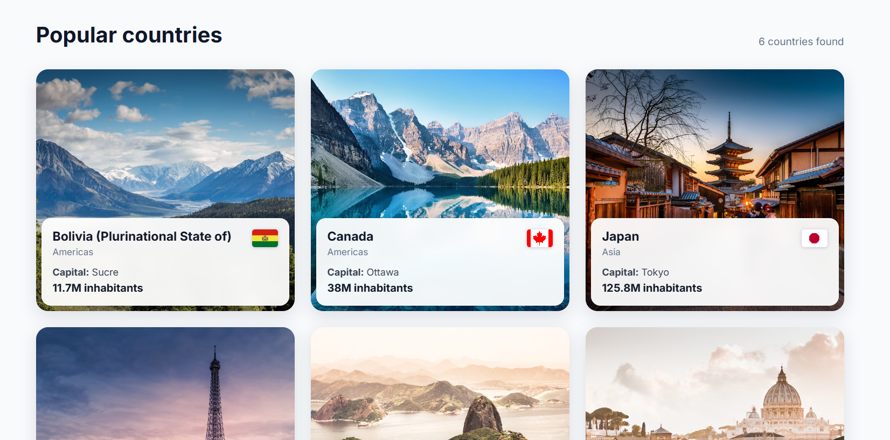

Proyecto elaborado por Cecilia Barrenechea 2026

Travel Atlas es una aplicación web para explorar países del mundo: información general, banderas, monedas, idiomas y más, consumiendo datos en tiempo real desde una API pública.

Funcionalidades principales:

Búsqueda de países
Exploración de la lista de países disponibles
Visualización de detalle por país (bandera, moneda, idiomas, capital, entre otra información)

Tecnologías utilizadas
React
Vite como bundler y servidor de desarrollo
React Router para el enrutamiento entre páginas
ESLint
countries.dev API — API pública y gratuita de datos de países (sin necesidad de API key)

Despliegue:

Servidor propio en Google Cloud
PM2 como gestor de procesos
FreeDNS para el dominio

Imagenes de la pagina web desplegada

Sitio en vivo: 
[travelatlas.ignorelist.com](https://travelatlas.ignorelist.com)  
[www.travelatlas.ignorelist.com](https://www.travelatlas.ignorelist.com)

Estructura del proyecto
src/
├── components/     # Componentes reutilizables (Header, Footer, CountryCard, CountryGrid, SearchForm, Popup, Loader, Hero)
├── pages/          # Páginas de la app (Home, Explore)
├── utils/          # Funciones utilitarias
├── styles/         # Estilos globales
├── assets/         # Imágenes e íconos
└── vendor/         # Fuentes tipográficas